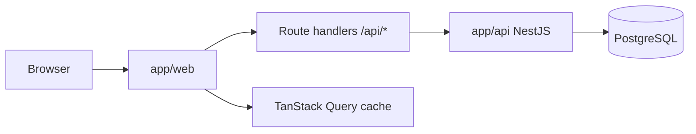
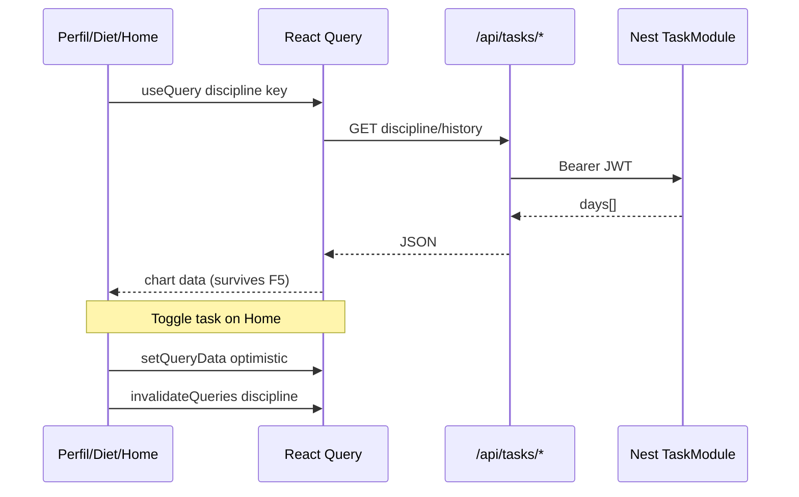

# Arquitetura e Convenções — New-era

Documento canônico do monorepo após a modernização de segurança, dados, frontend e documentação. Reflete o estado **atual** do código.

---

## Visão geral

**New-era** é um monorepo npm com duas aplicações:

| Pacote     | Stack                                      | Papel                          |
|-----------|---------------------------------------------|--------------------------------|
| `app/web` | Next.js 16 (App Router), React, TypeScript, Tailwind, TanStack Query | UI + BFF (route handlers)      |
| `app/api` | NestJS, TypeScript, Prisma, PostgreSQL      | API REST autenticada por JWT   |

**Portas (dev):**

- Proxy / entrada do usuário: `http://localhost:6000`
- Next.js: `http://localhost:6002`
- API NestJS: `http://localhost:6001`

O browser fala apenas com o Next (BFF). O BFF repassa requisições autenticadas à API usando o cookie `auth_token` (JWT). A URL da API (`API_URL`) é **server-only** — nunca exposta via `NEXT_PUBLIC_*`.

---

## Objetivos do sistema

- **Fitness & lifestyle:** treinos semanais, dieta, medidas corporais, metas de macros, água, tasks diárias e disciplina.
- **Finanças:** ledger único em **USDT**; BRL só na camada de apresentação (`money-format.ts`). Execução centralizada em `FinanceExecutionService`; leitura de patrimônio/P&L em `PortfolioReadService` com cotações live. Transações **append-only** (sem `PATCH` destrutivo). Trade canônico: `POST /finance/market/trade`; preview: `POST /finance/market/preview`.
- **Perfil:** dados do usuário, avatar, gráficos de atividade/disciplina.
- **Experiência dashboard:** layout fixo na viewport, scroll apenas dentro de cards; responsivo com sidebar drawer em mobile.

---

## Arquitetura atualizada



### Camadas

1. **UI (components):** presentacional; props `data` / `actions` / `ui`.
2. **Hooks (`hooks/`):** estado, regras, orquestração; consomem React Query ou mutations.
3. **Services (`services/`):** HTTP tipado para o BFF (`/api/...`), nunca para a API Nest diretamente no client.
4. **BFF (`app/api/**/route.ts`):** cookie → Bearer, validação de params, whitelist de body, erros seguros.
5. **API Nest (`modules/<domínio>/`):** controller → service → Prisma; DTOs com `class-validator`.
6. **Prisma:** schema único, migrações versionadas, `$transaction` em operações multi-step.

### Finanças (domínio)

| Conceito | Implementação |
|----------|----------------|
| **Ledger** | Saldos e transações em USDT (`Decimal(18,6)`) |
| **Execução** | `FinanceExecutionService` — deposit, withdraw, buy, sell, register |
| **Leitura** | `PortfolioReadService` — equity live, snapshot OPENING/CLOSING, today P&L |
| **Formatação UI** | `app/web/src/utils/money-format.ts` — pt-BR; sem regras de ordem no client |
| **Trade** | `POST /finance/market/trade` (+ `budgetUsdt`); preview em `/finance/market/preview` |
| **Deprecado** | `POST /finance/investments/:id/trade`, `PATCH /finance/transactions/:id`, update direto de `Wallet.balance` |

---

```txt
New-Era/
├── ARCHITECTURE.md
├── MODERNIZATION_REPORT.md      # relatório da auditoria/refatoração
├── app/
│   ├── web/
│   │   └── src/
│   │       ├── app/
│   │       │   ├── (auth)/          # login, registro, forgot-password
│   │       │   ├── (main)/          # dashboards autenticados
│   │       │   └── api/             # BFF (route handlers)
│   │       │       └── _lib/          # auth, params, api-error
│   │       ├── components/
│   │       │   ├── ui/              # primitivos (Button, Card, Dialog…)
│   │       │   ├── providers/       # QueryClientProvider
│   │       │   └── <feature>/       # diet, training, tasks, perfil…
│   │       ├── hooks/               # useXxx por domínio
│   │       ├── lib/                 # query-keys, app-toast
│   │       ├── services/            # http.ts + domínios
│   │       ├── types/
│   │       ├── utils/               # mappers, constantes puras
│   │       ├── config.ts            # API_URL server-only
│   │       └── middleware.ts        # guard de rotas por cookie
│   └── api/
│       └── src/
│           ├── common/
│           │   ├── auth/            # ownership, password, user.select
│           │   ├── config/          # env validation
│           │   ├── filters/         # PrismaExceptionFilter
│           │   └── pipes/           # ParseWeekdayPipe
│           ├── modules/<domínio>/   # auth, user, task, diet, workout…
│           └── prisma/
└── prisma/ (em app/api/prisma/)
```

Organização por **domínio/feature** dentro de cada app; evitar pastas “misc” ou lógica duplicada entre módulos.

---

## Fluxos de negócio (resumo)

### Autenticação

1. Login/registro via BFF → API `/auth/*` → JWT retornado → cookie `httpOnly` `auth_token`.
2. `middleware.ts` redireciona `(main)/*` sem cookie para `/login` e `(auth)/*` com cookie para `/`.
3. Cada route handler BFF lê o cookie e envia `Authorization: Bearer`.

### Tasks & disciplina

1. Tasks por weekday (`DailyTask`) + conclusões diárias (`TaskCompletion`).
2. Toggle atualiza completion, recalcula percentual e persiste `User.disciplineLevel` em **transação**.
3. Gráficos (Home, Perfil, Diet) usam `GET /tasks/discipline/history?days=&tab=` via React Query; toggle na Home invalida/atualiza cache otimisticamente.

### Treino / Dieta

1. Conteúdo indexado por `weekday` (0=Dom … 6=Sáb).
2. `useWeekdayNavigation` + `useCalendarDayChange` mantêm o dia atual após meia-noite.
3. Workout Plan sidebar: Rest Day / reativar sheet / **Remove sheet** (limpa título obsoleto).

---

## Fluxos de dados (disciplina + F5)



Chaves centralizadas em `lib/query-keys.ts`. Não usar contexto pub/sub caseiro para sincronização de gráficos.

---

## Estratégias de segurança

### API (NestJS)

| Medida | Implementação |
|--------|----------------|
| JWT | `JWT_SECRET` obrigatório (≥16 chars), sem fallback; algoritmo fixo `HS256` |
| Validação entrada | `ValidationPipe`: `whitelist`, `forbidNonWhitelisted`, `transform` |
| DTOs | Classes `class-validator` em todos os módulos; campos sensíveis nunca no body |
| Rate limit | `@nestjs/throttler` global; limites estritos em `/auth/*` |
| Headers | `helmet` em `main.ts` |
| Payload | Limite 2 MB |
| CORS | `CORS_ORIGINS` via env |
| Ownership | `assertResourceOwner` / `assertResourceExists` em task, diet, workout, finance |
| Wallets em transações | Validação de que wallets pertencem ao `userId` |
| Users | Sem `GET /users` público; `PATCH/DELETE` só próprio usuário |
| Senha | Mínimo 8 caracteres; bcrypt 10 rounds |
| Prisma errors | `PrismaExceptionFilter` — sem vazar detalhes internos |
| Seed | Bloqueado em `NODE_ENV=production` |

### BFF (Next.js)

| Medida | Implementação |
|--------|----------------|
| IDs dinâmicos | `isValidResourceId` (CUID-like) antes de interpolar URL upstream |
| Erros | `upstreamErrorResponse` — só `message` estruturada ao client |
| Profile PATCH | Whitelist de campos; `photoUser` só `https:` ou `data:image/*` |
| Reset password | Resposta fixa `{ ok: true }` — não repassa corpo upstream |
| Middleware | Guard de sessão por cookie |
| Headers | `next.config.ts`: X-Frame-Options, nosniff, HSTS, Referrer-Policy |

### Riscos remanescentes (ver MODERNIZATION_REPORT.md)

- Reset de senha ainda usa email+CPF (sem token de uso único por e-mail).
- Sem refresh tokens / rotação de JWT.
- CSRF: mitigado por SameSite cookie + BFF same-origin; token CSRF explícito não implementado.

---

## Estratégias de performance

- **React Query:** cache por query key, `staleTime` 30s, `keepPreviousData` em gráficos, invalidação cirúrgica após mutations.
- **Evitar fetch duplicado:** uma query `['me']` para perfil/sidebar; day-queries por `['diet-day', weekday]` etc.
- **Memo:** list rows (`TaskRow`, etc.) com `memo` onde aplicável.
- **Code splitting:** App Router divide por rota automaticamente; preferir dynamic import só para blocos pesados futuros.
- **API:** índices em colunas de filtro frequente; `take: 200` em listagens financeiras; transações Prisma em writes críticos.
- **Dashboard layout:** `min-h-0` + scroll interno — evita reflow da página inteira.

---

## Convenções de código

### Frontend

- `'use client'` somente quando necessário (estado, efeitos, eventos).
- Props de componentes de feature: `{ data, actions, ui? }`.
- Hooks retornam objeto nomeado estável.
- `cn()` para classes; variantes no `components/ui`.
- Toasts: `toastAuthError` / `toastUpdated` (success) via `lib/app-toast.ts`.

### Tipografia

**Font stack:** Geist Sans (`--font-geist-sans`) no corpo da UI; Geist Mono (`--font-geist-mono`) reservado para dados tabulares quando necessário. Configurado em `app/web/src/app/layout.tsx` e tokens em `app/web/src/app/globals.css`.

**Tokens semânticos** (`@utility type-*` + `lib/typography.ts`):

| Token | Tamanho | Uso |
|-------|---------|-----|
| `type-hero` | 3rem | Títulos hero de auth (Welcome, Create Account, Forgot Password) |
| `type-display` | 1.875rem → 2.25rem (sm+) | Display / auth secundário |
| `type-page` | 1.5rem | Título de página (`PageHeader`) |
| `type-title` | 1.125rem | Título de card, dialog, sheet |
| `type-stat-lg` | 1.5rem → 1.875rem (md+) | Balances e valores grandes |
| `type-stat` | 1.25rem → 1.35rem (lg+) | KPIs de cards, métricas |
| `type-body` | 0.875rem | Texto padrão, inputs |
| `type-body-strong` | 0.875rem semibold | Destaque inline, botões |
| `type-label` | 0.75rem medium | Labels, nav, badges |
| `type-caption` | 0.75rem muted | Subtítulos, hints |
| `type-overline` | 0.625rem uppercase | Cabeçalhos de tabela/legenda |
| `type-micro` | 0.6875rem | Eixos de gráfico, UI densa |

**Tons** (`typeToneClass` em `@/lib/typography`):

- `default` → `text-text`
- `muted` / `muted60` → texto secundário
- `accent` → `text-red`
- `positive` / `negative` → `text-green` / `text-red`
- `onAccent` → `text-on-accent`

**Regras obrigatórias:**

1. Importar `typeClass` e `typeToneClass` de `@/lib/typography` e compor com `cn()` — não usar `text-sm`, `text-lg`, `font-semibold` soltos para papéis semânticos.
2. Não usar `text-[Npx]` arbitrário — usar `type-micro`, `type-overline` ou estender o sistema.
3. Títulos de card: `cn(typeClass.title, typeToneClass.accent)` (ou `default` quando neutro).
4. Valores numéricos/KPI: `typeClass.stat` ou `typeClass.statLg` (já incluem `tabular-nums`).
5. Primitivos em `components/ui/` devem consumir os mesmos tokens (ex.: `Button` → `type-body-strong`).

Referências: `app/web/src/lib/typography.ts`, `app/web/src/app/globals.css`.

### Backend

- Um módulo Nest por domínio: `*.module.ts`, `*.controller.ts`, `*.service.ts`, `dto/`.
- Controllers finos; regra de negócio no service.
- `USER_PUBLIC_SELECT` para respostas de usuário — nunca `passwordHash`.
- `ParseWeekdayPipe` para query/param `weekday` (0–6).

### Botões (hover)

Referência: botão Cancel em `diet-create-meal-dialog.tsx`.

- **Primary (save):** `bg-red text-on-accent` → hover `hover:bg-layer2-half hover:text-text`
- **Secondary / cancel:** `bg-layer2` → hover `hover:bg-layer2-half`
- **Destructive (delete confirm):** variante `destructive` em `button.tsx`

### Layout dashboard

- Viewport sem scroll global; overflow em cards (`overflow-auto`, `min-h-0`).
- Gutter simétrico `1.5rem`; em `lg+` offset `pl-[calc(360px+1.5rem)]` para sidebar fixa.
- Mobile: sidebar off-canvas + hamburger (`app-sidebar.tsx`); conteúdo `pt-16` até `lg`.

---

## Boas práticas obrigatórias

1. Nunca commitar `.env`, secrets ou `dist/`.
2. Validar DTOs no API **e** whitelist no BFF para campos expostos ao browser.
3. Toda rota BFF com `[id]` deve usar `isValidResourceId`.
4. Operações que alteram múltiplas tabelas → `prisma.$transaction`.
5. Novos gráficos/listas compartilhados → registrar key em `query-keys.ts` e invalidar no mutation certo.
6. Rodar `npm run build` em `app/api` e `app/web` antes de merge.
7. Preferir mudanças incrementais por domínio com checkpoint de build.

---

## Como criar novas features (Web)

1. Página em `app/(main)/<rota>/page.tsx`.
2. Route handlers BFF em `app/api/<domínio>/` usando `_lib/auth.ts` e `api-error.ts`.
3. Service em `services/<domínio>.ts` chamando `/api/...`.
4. Tipos em `types/<domínio>.ts`; mappers puros em `utils/`.
5. Hook `useXxxDashboardState` ou `useXxxQuery` com React Query.
6. Componentes presentacionais em `components/<feature>/`.
7. Registrar query keys; definir invalidação após mutations.
8. Validar layout dashboard (sem scroll de página) e mobile.

---

## Como criar novos componentes

1. Colocar primitivos reutilizáveis em `components/ui/`.
2. Colocar UI de domínio em `components/<feature>/`.
3. Sem fetch direto — receber dados via props.
4. Exportar tipos de props explícitos.
5. Usar `NativeDialog` com `ariaLabelledBy` quando modal.
6. Listas longas: considerar `memo` na row.

---

## Como criar novos serviços (Web)

```ts
// services/example.ts
import { getJson, postJson } from '@/services/http';

export function getExample() {
  return getJson<{ items: ExampleVm[] }>('/api/example', {
    cache: 'no-store',
    credentials: 'include',
  });
}
```

- Erros normalizados via `HttpError` em `http.ts`.
- Nunca chamar `API_URL` / Nest diretamente do client.

---

## Como criar novos endpoints (API)

1. DTOs com `class-validator` em `dto/*.dto.ts`.
2. Métodos no `service` com ownership checks.
3. Rotas no `controller` com `@UseGuards(JwtAuthGuard)` (exceto auth público).
4. Registrar módulo em `app.module.ts`.
5. Espelhar rota no BFF com validação de params e erros seguros.
6. Adicionar testes unitários para regra crítica (ownership, transação, validação).

**Variáveis de ambiente (`app/api/.env`):** ver `.env.example` — `DATABASE_URL`, `JWT_SECRET` obrigatórios.

---

## Checklist de revisão (PR)

- [ ] Tipografia usa tokens `type-*` / `typeClass`?
- [ ] DTOs / whitelist impedem mass assignment?
- [ ] Ownership verificado para recursos do usuário?
- [ ] BFF valida IDs e sanitiza body?
- [ ] Query keys registradas e invalidadas?
- [ ] Sem secrets ou URLs internas no client bundle?
- [ ] Layout dashboard sem scroll de viewport?
- [ ] Mobile testado (sidebar, grids)?
- [ ] `npm run build` api + web OK?
- [ ] Testes unitários relevantes adicionados/atualizados?

---

## Checklist de deploy

- [ ] `JWT_SECRET` forte (≥32 chars recomendado) definido no ambiente
- [ ] `DATABASE_URL` apontando para Postgres de produção
- [ ] `CORS_ORIGINS` com domínios reais (sem `*`)
- [ ] `NODE_ENV=production`
- [ ] Migrações Prisma aplicadas (`prisma migrate deploy`)
- [ ] Seed **não** executado em produção
- [ ] `API_URL` no web apontando para API interna/rede privada
- [ ] HTTPS terminado no reverse proxy (HSTS já enviado pelo Next)
- [ ] Backup de banco configurado
- [ ] Health check: `GET /health` na API

---

## Referências rápidas

- Relatório de auditoria e riscos: [MODERNIZATION_REPORT.md](./MODERNIZATION_REPORT.md)
- Query keys: `app/web/src/lib/query-keys.ts`
- Tipografia: `app/web/src/lib/typography.ts`
- Ownership: `app/api/src/common/auth/ownership.util.ts`
- Env validation: `app/api/src/common/config/env.validation.ts`
