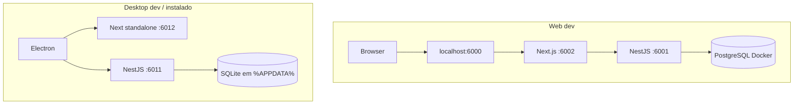

# Getting Started — New-Era

Guia prático para rodar o **New-Era** em três modos: **web no navegador**, **desktop em desenvolvimento** e **app instalado no Windows**.

---

## Visão geral

| Modo | Comando principal | Banco de dados | Docker? | Ideal para |
|------|-------------------|----------------|---------|------------|
| **Web (dev)** | `npm run dev` | PostgreSQL | Sim | Desenvolver UI/API com hot reload |
| **Desktop (dev)** | `npm run dev:desktop` | SQLite local | Não | Testar Electron, notificações nativas, fluxo offline |
| **Desktop (instalado)** | `New-Era Setup.exe` | SQLite local | Não | Uso diário no PC, sem terminal aberto |



---

## Pré-requisitos

- **Node.js 20+** e **npm 10+**
- **Git**
- **Docker Desktop** — apenas para o modo **web** (PostgreSQL)
- **Windows 10/11** — para build e instalação do app desktop

Na primeira vez, na raiz do repositório:

```bash
npm install
```

---

## Configuração inicial (uma vez)

### 1. Variáveis de ambiente — API (web)

```bash
cp app/api/.env.example app/api/.env
```

PowerShell:

```powershell
Copy-Item "app/api/.env.example" "app/api/.env"
```

Edite `app/api/.env` e defina um `JWT_SECRET` forte (mínimo 16 caracteres):

```bash
node -e "console.log(require('crypto').randomBytes(32).toString('hex'))"
```

### 2. Variáveis de ambiente — Web

```bash
cp app/web/.env.example app/web/.env.local
```

PowerShell:

```powershell
Copy-Item "app/web/.env.example" "app/web/.env.local"
```

### 3. Banco PostgreSQL (somente web)

Com o Docker Desktop rodando:

```bash
npm run db:up
npm run prisma:migrate -w app/api
npm run prisma:generate -w app/api
```

Para derrubar o container:

```bash
npm run db:down
```

Credenciais padrão do Postgres local:

| Campo | Valor |
|-------|-------|
| Host | `localhost` |
| Porta | `5432` |
| Usuário | `postgres` |
| Senha | `postgres` |
| Database | `app_db` |

---

## Modo 1 — Web (desenvolvimento)

Fluxo completo: navegador → proxy → Next.js → API Nest → PostgreSQL.

### Subir o projeto

Terminal 1 — certifique-se de que o Docker/Postgres está ativo:

```bash
npm run db:up
```

Terminal 2 — na raiz:

```bash
npm run dev
```

### URLs

| Serviço | URL |
|---------|-----|
| **App (use esta)** | [http://localhost:6000](http://localhost:6000) |
| Next.js (interno) | [http://localhost:6002](http://localhost:6002) |
| API NestJS | [http://localhost:6001](http://localhost:6001) |
| Health check | [http://localhost:6001/health](http://localhost:6001/health) |

> O Next.js roda na porta `6002` e um proxy local expõe tudo em `6000`, que é a URL que você abre no navegador.

### Dicas

- Se `prisma migrate` falhar com `P1001`, o Postgres não está rodando — execute `npm run db:up`.
- Para resetar o banco web (apaga todos os dados):

  ```bash
  npx prisma migrate reset --force --skip-seed
  ```

  Execute dentro de `app/api`, com Docker ativo.

---

## Modo 2 — Desktop (desenvolvimento)

O Electron sobe **API + Next standalone** sozinho, usando **SQLite** em `%APPDATA%\New-Era`. **Não precisa de Docker.**

### Subir

Na raiz:

```bash
npm run dev:desktop
```

Equivalente:

```bash
npm run dev -w app/desktop
```

### O que acontece

1. Splash de loading com etapas (banco, API, interface).
2. API Nest na porta **6011**.
3. Next standalone na porta **6012**.
4. Janela Electron abre em `/login`.
5. Ícone na bandeja do sistema; notificações nativas do Windows.

### Dados locais (dev)

| Item | Caminho |
|------|---------|
| Pasta principal | `%APPDATA%\New-Era` |
| Banco SQLite | `%APPDATA%\New-Era\data\app.db` |
| Config (tokens) | `%APPDATA%\New-Era\config.json` |
| Logs | `%APPDATA%\New-Era\logs` |

### Limpar e começar do zero (dev)

Feche o app e remova a pasta de dados:

PowerShell:

```powershell
Remove-Item -LiteralPath "$env:APPDATA\New-Era" -Recurse -Force
```

Na próxima execução, um banco e config novos serão criados automaticamente.

### Limite de contas (desktop)

No modo desktop, o registro permite no máximo **2 contas locais**. Para registrar outra, exclua uma conta em **Profile**.

---

## Modo 3 — App instalado (Windows)

### Opção A — Baixar pelo GitHub Actions (recomendado)

1. Abra o repositório no GitHub.
2. Vá em **Actions** → workflow **Desktop Build**.
3. Dispare manualmente (**Run workflow**) ou crie uma tag `desktop-v*` (ex.: `desktop-v1.0.1`) e faça push.
4. Ao terminar o job, baixe o artifact **New-Era-Setup** (`New-Era Setup.exe`).
5. Execute o instalador e siga o assistente (NSIS permite escolher pasta de instalação).

### Opção B — Gerar o instalador localmente

Na raiz, com dependências instaladas:

```bash
npm run build:desktop
```

O instalador fica em:

```txt
app/desktop/dist/New-Era Setup.exe
```

Esse comando:

1. Gera o Prisma client desktop (SQLite).
2. Compila API e web standalone para desktop.
3. Empacota recursos em `app/desktop/resources/`.
4. Recompila módulos nativos (bcrypt, Prisma).
5. Gera o `.exe` com electron-builder.
6. Restaura o Prisma client web (PostgreSQL) para dev web.

> Após `build:desktop`, se for voltar ao dev web, confirme que o client Postgres está ok: `npm run prisma:generate -w app/api`.

### Instalar

- **Interativo:** dê duplo clique em `New-Era Setup.exe`.
- **Silencioso (PowerShell):**

  ```powershell
  Start-Process "app\desktop\dist\New-Era Setup.exe" -ArgumentList "/S" -Wait
  ```

Instalação padrão:

```txt
C:\Users\<you>\AppData\Local\Programs\New-Era\New-Era.exe
```

Atalho na área de trabalho e entrada na bandeja são criados automaticamente.

### Desinstalar

- **Configurações do Windows** → Aplicativos → **New-Era**, ou
- Execute:

  ```txt
  C:\Users\<you>\AppData\Local\Programs\New-Era\Uninstall New-Era.exe
  ```

Para remover também os dados (contas, banco SQLite, cache):

```powershell
Remove-Item -LiteralPath "$env:APPDATA\New-Era" -Recurse -Force
```

---

## Comparação rápida: web vs desktop

| | Web dev | Desktop dev / instalado |
|---|---------|-------------------------|
| Banco | PostgreSQL (Docker) | SQLite (`%APPDATA%\New-Era\data\app.db`) |
| Portas API / UI | 6001 / 6000 | 6011 / 6012 (interno ao Electron) |
| Hot reload | Sim (Next + Nest watch) | Rebuild ao reiniciar `dev:desktop` |
| Notificações Windows | Via browser | Nativas (toast + bandeja) |
| Internet | Necessária para cotações | Cotações com cache offline parcial |
| Máx. contas | Ilimitado (dev) | 2 contas locais |

---

## Scripts úteis (raiz)

| Script | Descrição |
|--------|-----------|
| `npm run dev` | Web: Next + API |
| `npm run dev:desktop` | Desktop Electron em dev |
| `npm run db:up` / `db:down` | Sobe/derruba Postgres |
| `npm run build:desktop` | Gera `New-Era Setup.exe` |
| `npm run lint` | ESLint web + API |
| `npm run format:write` | Prettier em todo o repo |

---

## Problemas comuns

### Docker não conecta (`P1001`)

Inicie o **Docker Desktop** e rode `npm run db:up`.

### `prisma generate` falha (wasm / query engine)

Reinstale os pacotes Prisma:

```bash
npm install prisma@6.16.3 @prisma/client@6.16.3 -w app/api
npm run prisma:generate -w app/api
```

### Desktop dev sem CSS / assets

O script `sync-web-standalone.mjs` copia `.next/static` e `public` para o standalone. Rode de novo:

```bash
npm run dev:desktop
```

### Primeira abertura do desktop demora

A splash avisa: migrations SQLite, bootstrap da API e do Next podem levar alguns minutos na **primeira** execução.

### Voltar do desktop para web dev

```bash
npm run prisma:restore:web -w app/api
npm run db:up
npm run dev
```

---

## Documentação relacionada

- [README.md](./README.md) — visão geral e stack
- [ARCHITECTURE.md](./ARCHITECTURE.md) — arquitetura, camadas e convenções do monorepo
